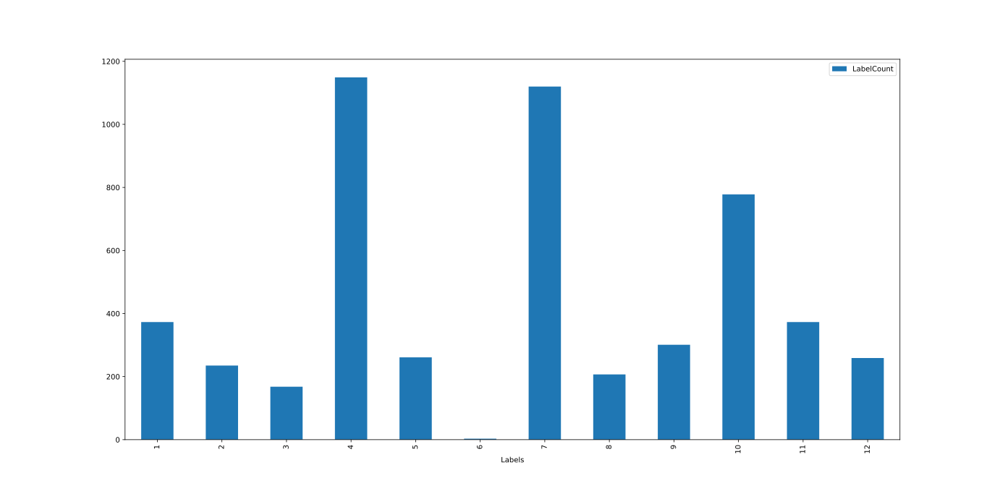

# Text Classification with Bi-Directional LSTM
This work was done for Santa Clara University's Deep Learning course taught by Professor Anastasiu

## Introduction

A Bi-Directional LSTM with a 300-dimensional GloVe word embedding was built to classify a corpus of text recipes. The model achieved a validation F1 score of 0.9058

## Dataset

The dataset consists of 47043 text records with 41816 used for training and 5227 used for validation. Each text record is a recipe, consisting of one or more sentences all on one line. There are 12 different types of recipes, with the labels indexing from 1-12. Each label in train.labels corresponds to a recipe in train.txt such that the number on the nth line of the labels file is the label for the nth recipe in the text file. This also goes for the validation set. Both the training distribution and validation distribution are highly imbalanced as seen in the bar plots below.

<p align="center">
  
</p>

<p align="center">
  Recipe Label Training Distribution 
</p>

<p align="center">
  
</p>

<p align="center">
  Recipe Label Validation Distribution 
</p>

## Model

The task at hand was to build and train (from scratch) a recurrent neural network to classify each recipe. Several different network architectures were tried such as a single LSTM layer, a CNN layer before the Bi-LSTM, with and without a Dense layer, a stacked Bi-LSTM, and various combinations of max token lengths, unit and neuron counts, and different word embedding sizes. 

The final model consisted of a max token length of 400 with shorter training samples appended with zeros. Longer samples were truncated by keeping the first 400 tokens and the rest tossed out. In order to transform these word tokens into a different space, I used a 300-dimensional GloVe word embedding that had been trained with 6B tokens and a 400k vocab. The GloVe word embedding is not included in this directory because it is too large but it can be found [here](https://nlp.stanford.edu/projects/glove/). I passed this word embedding to a Bidirectional LSTM containing 100 units which then went to a neural network layer containing 128 neurons. This was then passed to a softmax layer to output the classes. Two dropout layers were employed, both with a 20% frequency rate, one between the Bi-LSTM and Dense as well as one in between the Dense and softmax layer. This was to help prevent overfitting and generalize to unseen test data. The Dense layer used a ReLU activation function, the model used the Adam optimizer with a learning rate of 0.01, and the loss function computed was the categorical cross entropy.

<p align="center">
  
</p>

## Training

Using the Adam optimizer and a learning rate of 0.01, I trained my network for 43 epochs. It was found that after approximately 10 epochs the validation loss begins to diverge as the training loss continues to decrease. Interestingly, even though the validation loss was increasing, so was the validation F1 score. It is my understanding that the network is beginning to overfit but in doing so it is also learning useful information about the training data that applies to the validation set. Therefore, even though the validation loss is increasing, the network as a whole is still performing better. I suspect this is in part due to a label imbalance in both the training and validation set. Epoch 14 was chosen as the final model which had a validation F1 score of 0.9058 and a validation loss of 0.4786. Different learning rates along with the SGD optimizer were experimented with but found to have worse performance. A learning rate of 0.001 and 0.005 was attempted but found to have little impact on the overall performance.

<p align="center">
  
</p>

## Results

<p align="center">

| Model                           | Validation F1 |
| :-----------------------------: | :-----------: |
| Bi-LSTM (final model)           | 0.9058        |
| Stacked Bi-LSTM (100 units x2)  | 0.9005        |
| LSTM (100 units)                | 0.8875        |
| Bi-LSTM (200d word embedding)   | 0.8825        |
| Bi-LSTM (100d word embedding)   | 0.8745        |

</p>

The size of the word embeddings made a big difference. The first model built contained only a 100-dimensional word vector but when 200 and 300 were used the overall performance increased by 1% each time. It was also found that the max token length had a large impact on model performance. Any larger than 400 began to negatively impact performance as well as token lengths that were shorter than 350. Upon further evaluation I learned that too long of a sequence can make it difficult for the network to successfully perform backpropagation so this likely explains the drop in performance with lengths greater than this. Luckily this wasn’t too much of an issue as nearly all the training and validation samples were less than 400 words, resulting in very few samples needing to be truncated. One architectural take away was that the LSTM and stacked Bi-LSTM had very similar performance with the final model used. This seemed to indicate that the network itself was well-suited to learn the data and that further improvement would be difficult without augmenting the data or extracting more learnable features.

## Usage

How to get validation performance

```sh
python test_model.py
```

This script will pull in the training data to generate the dictionary, read the model stored as model17_14.hd5, and then read the validation data to report the F1 score. The script expects the data directory to be in the same directory the script is running from.

How to re-train the model

```sh
python baseline17.py
```

Note that the GloVe word embeddings are not included in this directory and need to be downloaded separately. 
